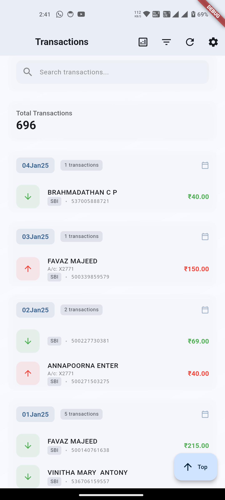
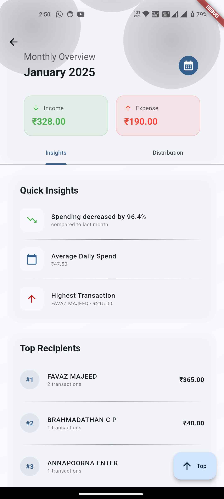
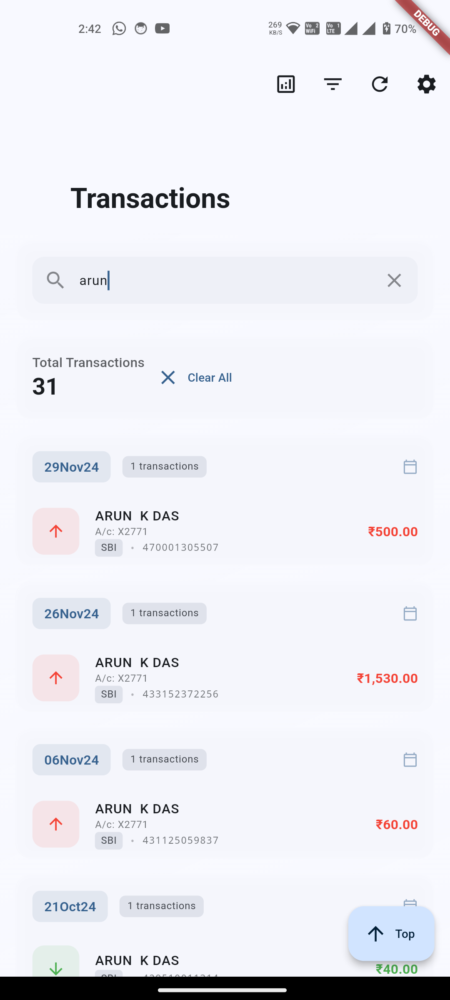
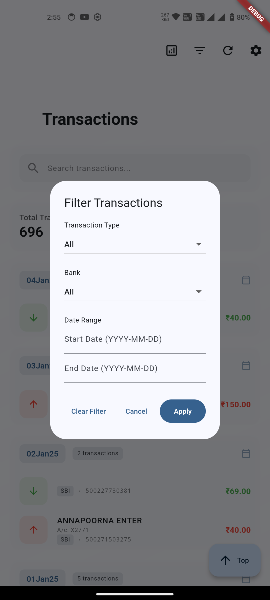

# FlowTrack - SMS Transaction Tracker

<div align="center">
  
  <h3>Track your finances through SMS notifications</h3>
</div>

## 📱 About FlowTrack

FlowTrack is a modern, user-friendly mobile application designed to help you track and analyze your financial transactions through SMS notifications. It automatically processes bank SMS messages to provide you with insightful analytics about your spending patterns.

## 📸 Screenshots

<div align="center">
  <table>
    <tr>
      <td align="center"><strong>Home Screen</strong></td>
      <td align="center"><strong>Analytics</strong></td>
    </tr>
    <tr>
      <td></td>
      <td></td>
    </tr>
    <tr>
    <td align="center"><strong>Search</strong></td>
    <td align="center"><strong>Filter</strong></td>
    </tr>
    <tr>
      <td></td>
      <td></td>
    </tr>
  </table>
</div>

## ✨ Features

- 🏦 **Automatic SMS Processing**: Automatically detects and processes bank transaction SMS messages
- 📊 **Transaction Analytics**: View detailed statistics and spending patterns
- 🔍 **Smart Search**: Easily search through your transactions
- 🏷️ **Transaction Filtering**: Filter transactions by:
  - Transaction type (Credit/Debit)
  - Bank name
  - Date range
- 📈 **Financial Insights**:
  - Monthly spending analysis
  - Top spending categories
  - Transaction history
  - Bank-wise distribution
- 🎨 **Modern UI/UX**:
  - Material Design 3
  - Dark/Light theme support
  - Smooth animations
  - Intuitive interface

## 🛠️ Technical Details

### Built With
- Flutter Framework
- Dart Programming Language
- Material Design 3
- Local Storage using SharedPreferences

### Supported Banks
- SBI Bank
- Kerala Gramin Bank
- [More banks to be added]

### SMS Format Support
Currently supports the following SMS formats:
```
Credit Format:
"Ac XXXX4321 credited by Rs.1,000.00 on 01-Jan-24 by UPI ref no 123456789 -BANK"

Debit Format:
"Dear user A/C XX4321 debited by Rs.500.00 on date 01Jan24 trf to COFFEE SHOP Refno 987654321. -BANK"
```

## 📲 Installation

[](https://github.com/abelboby/flowtrack/releases/latest)

1. Download the APK from the [releases section](https://github.com/abelboby/flowtrack/releases)
2. Enable "Install from Unknown Sources" in your device settings
3. Install the APK
4. Grant SMS permissions when prompted
5. Start tracking your transactions!

### Permissions Required
- `READ_SMS`: To read bank transaction messages
- `RECEIVE_SMS`: To process new incoming bank messages

## 🔒 Privacy & Security

- All data is stored locally on your device
- No data is sent to external servers
- Only bank transaction SMS messages are processed
- Your SMS data remains private and secure

## 🚀 Development Journey

This app was developed with several key considerations:

1. **SMS Processing Logic**:
   - Implemented regex patterns for different bank message formats
   - Created a robust parser for extracting transaction details
   - Handled various date formats and transaction types

2. **UI/UX Design**:
   - Created a modern, glassmorphic design
   - Implemented smooth animations and transitions
   - Designed an intuitive navigation flow

3. **Performance Optimization**:
   - Efficient SMS processing
   - Optimized list rendering
   - Smooth scrolling and animations

4. **Data Management**:
   - Local storage implementation
   - Transaction data structure design
   - Efficient filtering and search algorithms

## 🤝 Future Updates

Planned features for upcoming releases:
- Support for more banks and SMS formats
- Export transactions to CSV/PDF
- Custom categories for transactions
- Budget tracking and alerts
- Transaction insights with AI
- Cloud backup option
- Widgets for quick insights
- Transaction sharing

## 🤝 Contributing

Feel free to fork this project and submit pull requests. You can help by:
- Adding support for more banks
- Improving SMS parsing accuracy
- Adding new features
- Enhancing the UI/UX
- Fixing bugs

## 📝 Contact

For support or queries:
- Email: [abeldavisboby@gmail.com](mailto:abeldavisboby@gmail.com)
- LinkedIn: [Abel Davis Boby](https://www.linkedin.com/in/abeldavisboby)
- GitHub: [AbelBoby](https://github.com/abelboby)

---

<div align="center">
  Made with ❤️ using Flutter
</div>
